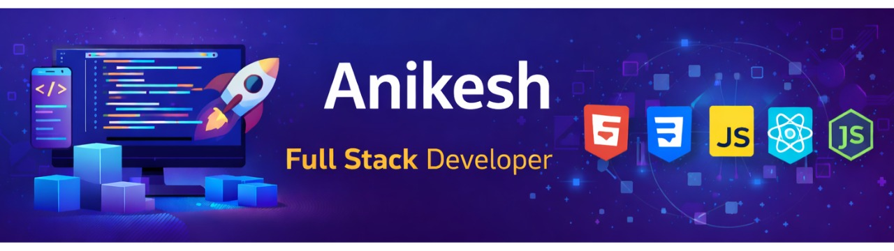

<h1 align="center">Hi 👋, I'm  Anikesh Tiwari</h1>
<h3 align="center">Full Stack Developer | Information Science Engineering Student</h3>
 
 

  ✨ Learning full-stack development  

  📚 Exploring Node.js & Backend Systems  

  🎯 Interested in real-world software projects

  <!--  -->
 

 ## 🐍 Contribution Snake
  

<!-- 

  

 -->
 

 
<!-- ===================== ABOUT ME ===================== -->
<h2 align="left">👨‍💻 About Me</h2>
 

🚀 Final-year Information Science Engineering student  

💻 Full Stack Developer with hands-on experience in real-world projects  

🧠 Skilled in PHP, JavaScript, Python, and modern web technologies   

⚡ Focused on building scalable, efficient, and user-friendly applications

 

<h2 align="left">⚡ Core Skills</h2>

✔️ Full Stack Web Development  
✔️ REST API Development  
✔️ Backend Development (Node.js, PHP)  
✔️ Frontend Development (React, JavaScript, Tailwind CSS)  
✔️ Database Design (MySQL, MongoDB)  
✔️ Authentication & Security (JWT)

<h2 align="left">🚀 Featured Projects</h2>

<ul>

<li>
<strong>🌐 Portfolio Website</strong> 
🔹 Personal portfolio showcasing projects and skills 
🔹 Tech: HTML, CSS, JavaScript 
🔹 <a href="https://anikeshtiwari.github.io/Anikesh-Portfolio/">Live Demo</a>
</li>

 

<li>
<strong>💻 Full Stack App (Add your project)</strong> 
🔹 Authentication system + API + database 
🔹 Tech: Node.js, Express, MongoDB 
🔹 <a href="#">GitHub Repo</a>
</li>

</ul>
 
<!-- ===================== TECH STACK ===================== -->
<h2 align="left">🛠️ Tech Stack & Tools</h2>
 
<!-- Frontend -->
<h4 align="left">Frontend</h4>

 
 
 
<!-- Backend -->
<h4 align="left">Backend</h4>

 

🔹 RESTful APIs &nbsp;&nbsp; 🔹 JWT Authentication &nbsp;&nbsp; 🔹 MVC Architecture

 
 
 
<!-- Databases -->
<h4 align="left">Databases</h4>

 
 
 
<!-- Tools -->
<h4 align="left">Tools</h4>

 
 
 
<!-- Deployment -->
<h4 align="left">Deployment & Version Control</h4>

 

 
<!-- ===================== CONTACT ===================== -->
<h2 align="left">📫 Contact Me</h2>
 

 
  

 
 

 
  

 

<h2 align="left">📚 Currently Learning</h2>
 
<ul>
<li>Advanced Node.js & Backend Architecture</li>
<li>System Design Fundamentals</li>
<li>AI & Machine Learning Basics</li>
</ul>
 

 
<!-- ===================== COLLAB ===================== -->
<h2 align="left">🤝 Open to Collaborate</h2>
 

🤝 Open to open-source and real-world project collaborations  

📬 Feel free to reach out for teamwork and learning opportunities

 
