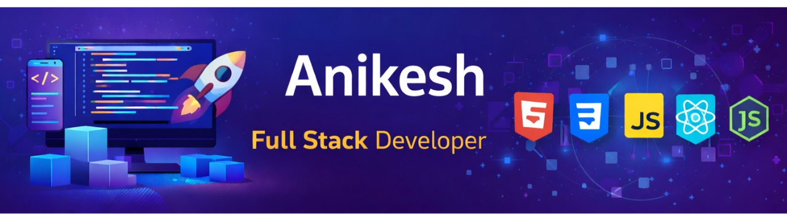

<h1 align="center">Hi 👋, I'm  Anikesh Tiwari</h1>
<h3 align="center">Backend & Full Stack Developer | NestJS • TypeScript • Laravel • PHP • PostgreSQL • MySQL</h3>

🚀 Backend Developer at <strong>Tourpublish (Riga, Latvia)</strong> | Building Scalable Cloud Backends & Microservices 
💻 TypeScript • NestJS • Node.js • PHP • Laravel • PostgreSQL • MySQL • Supabase 
🤖 AI/ML Prompt Engineering & LLM Integration 
🎯 RESTful APIs • Multi-Tenant Architecture • Stripe Payments • OpenTelemetry • RBAC

  

  

<!-- ===================== ABOUT ME ===================== -->
<h2 align="left">👨‍💻 About Me</h2>

🎓 B.E. Information Science & Engineering student at Brindavan Group of Institutions, VTU (CGPA: 7.50) 
💼 <strong>Backend Developer at Tourpublish (Riga, Latvia)</strong>, engineering enterprise NestJS/TypeScript backends, Supabase/PostgreSQL databases, and third-party cloud integrations 
⚙️ Strong proficiency across <strong>TypeScript, NestJS, Node.js, PHP, Laravel, PostgreSQL, MySQL, Supabase, and REST APIs</strong> 
🔗 Hands-on experience architecting <strong>Multi-Tenant systems, Stripe payment pipelines, OpenTelemetry observability, and Role-Based Access Control (RBAC)</strong> 
🤖 Certified AI/ML Prompt Engineer with practical background in LLM output evaluation and NLP testing pipelines

<!-- ===================== EXPERIENCE ===================== -->
<h2 align="left">💼 Work Experience</h2>

<table>

<!-- 1. TOURPUBLISH (LATEST / CURRENT) -->
<tr>
<td><strong>⚙️ Backend Developer</strong></td>
<td><strong>Tourpublish, Riga, Latvia</strong></td>
<td>July 2026 – Present</td>
</tr>
<tr>
<td colspan="3">
&nbsp;&nbsp;▶ Architecting enterprise-grade microservices and high-throughput RESTful APIs using <strong>NestJS 11, TypeScript, and Node.js</strong> 
&nbsp;&nbsp;▶ Designed scalable cloud database architectures with <strong>PostgreSQL and Supabase</strong>, optimizing complex query pipelines and indexing strategies 
&nbsp;&nbsp;▶ Integrated <strong>Stripe payment processing, AWS S3 storage presigning, Cloudflare, and Web-Push notification services</strong> 
&nbsp;&nbsp;▶ Implemented <strong>OpenTelemetry (OTLP)</strong> observability, OpenAPI/Swagger API documentation, and automated E2E testing with Jest & Supertest
</td>
</tr>

<tr><td colspan="3"> </td></tr>

<!-- 2. CATCHYSYSTEM -->
<tr>
<td><strong>🖥️ Full Stack Developer</strong></td>
<td><strong>Catchysystem Technologies Pvt. Ltd., Surat</strong></td>
<td>July 2025 – July 2026</td>
</tr>
<tr>
<td colspan="3">
&nbsp;&nbsp;▶ Engineered production multi-tenant web platforms using <strong>Laravel 12, PHP 8.2, MySQL, Inertia.js, and Blade</strong> 
&nbsp;&nbsp;▶ Built robust <strong>RESTful APIs, Sanctum authentication, and Spatie Role-Based Access Control (RBAC)</strong> across Healthcare, HRMS, and CRM modules 
&nbsp;&nbsp;▶ Integrated <strong>Yajra DataTables, DomPDF automated invoicing, and Maatwebsite Excel reporting</strong>, cutting document turnaround times by ~25% 
&nbsp;&nbsp;▶ Optimized database queries and multi-tenant schema migrations, reducing server latency by 20%
</td>
</tr>

<tr><td colspan="3"> </td></tr>

<!-- 3. LEARNERSBYTE -->
<tr>
<td><strong>🤖 AI/ML Prompt Engineering Intern</strong></td>
<td><strong>LearnersByte, Hyderabad</strong></td>
<td>Jan 2026 – May 2026</td>
</tr>
<tr>
<td colspan="3">
&nbsp;&nbsp;▶ Designed prompt architectures for 3 LLM-based NLP applications 
&nbsp;&nbsp;▶ Evaluated AI outputs across 10+ prompt configurations improving contextual accuracy 
&nbsp;&nbsp;▶ Integrated AI-generated content into 2 web applications reducing manual content effort by ~30% 
&nbsp;&nbsp;▶ Documented 20+ prompt strategies and testing results for team knowledge sharing
</td>
</tr>

<tr><td colspan="3"> </td></tr>

<!-- 4. TOUCHES COMPUTER -->
<tr>
<td><strong>🌐 Web Developer</strong></td>
<td><strong>Touches Computer, Surat</strong></td>
<td>Dec 2023 – Feb 2024</td>
</tr>
<tr>
<td colspan="3">
&nbsp;&nbsp;▶ Delivered 10+ production-ready responsive pages, improving session engagement by 20% 
&nbsp;&nbsp;▶ Optimised MySQL queries across 3 internal tools, cutting retrieval latency by 25% 
&nbsp;&nbsp;▶ Diagnosed and resolved 15+ cross-browser bugs across Chrome, Firefox, and Safari
</td>
</tr>

<tr><td colspan="3"> </td></tr>

<!-- 5. SUVYA WEB -->
<tr>
<td><strong>⚙️ Software Developer Intern</strong></td>
<td><strong>Suvya Web, Surat</strong></td>
<td>Sep 2023 – Nov 2023</td>
</tr>
<tr>
<td colspan="3">
&nbsp;&nbsp;▶ Implemented MVC-structured modules with 3 backend engineers across 2 client-facing releases 
&nbsp;&nbsp;▶ Reduced QA-reported defects by 15% through systematic unit testing and structured debugging 
&nbsp;&nbsp;▶ Refactored legacy code paths, improving system response time by ~10%
</td>
</tr>

</table>

<!-- ===================== SKILLS ===================== -->
<h2 align="left">⚡ Core Skills</h2>

✔️ <strong>Backend Development</strong> (NestJS · TypeScript · Node.js · Laravel · PHP · RESTful API Architecture · Microservices) 
✔️ <strong>Databases & Cloud</strong> (PostgreSQL · MySQL · Supabase · Multi-Tenancy · AWS S3 · Indexing & Optimization) 
✔️ <strong>API & Integrations</strong> (Stripe Payments · Web-Push · Resend Email · Swagger/OpenAPI · JWT & Sanctum Auth) 
✔️ <strong>Architecture & Security</strong> (Role-Based Access Control [RBAC] · OpenTelemetry Observability · Rate Limiting) 
✔️ <strong>AI / ML</strong> (Prompt Engineering · LLM Output Evaluation · NLP Pipeline Testing) 
✔️ <strong>Frontend & UI</strong> (JavaScript · Inertia.js · Blade · HTML5 · CSS3 · Bootstrap · Responsive UI) 
✔️ <strong>DevOps & Testing</strong> (Git · GitHub · Postman · Jest · Supertest · VS Code)

<!-- ===================== TECH STACK ===================== -->
<h2 align="left">🛠️ Tech Stack & Tools</h2>

<h4 align="left">Backend & Frameworks</h4>

🔹 RESTful API Architecture &nbsp;&nbsp; 🔹 Microservices &nbsp;&nbsp; 🔹 OpenTelemetry &nbsp;&nbsp; 🔹 Multi-Tenant Architecture &nbsp;&nbsp; 🔹 RBAC

 

<h4 align="left">Databases & Cloud</h4>

 

<h4 align="left">Frontend</h4>

 

<h4 align="left">AI / ML</h4>

🔹 Prompt Engineering &nbsp;&nbsp; 🔹 LLM Output Evaluation &nbsp;&nbsp; 🔹 NLP Pipeline Testing &nbsp;&nbsp; 🔹 A/B Prompt Testing

 

<h4 align="left">Tools & Workflow</h4>

<!-- ===================== PROJECTS ===================== -->
<h2 align="left">🚀 Featured Projects</h2>

<ul>

<li>
<strong>📊 Tuition Fee & Attendance Management System</strong> &nbsp;|&nbsp; <em>JavaScript · Supabase · PostgreSQL · SheetJS · Vanilla CSS</em> 
🔹 Production-grade coaching management portal with real-time Supabase cloud sync & offline resilience 
🔹 Built 3-tier Role-Based Access Control (Superadmin, Admin, Teacher, Viewer) with multi-level approval workflows 
🔹 Implemented 1–31 day interactive attendance matrix registers with Excel export and batch allocation (Morning/Afternoon) 
</li>

 

<li>
<strong>🦷 Dental Laboratory Multi-Tenant CRM</strong> &nbsp;|&nbsp; <em>Laravel 12 · PHP 8 · MySQL · Inertia.js · REST APIs</em> 
🔹 Developed an enterprise CRM for dental laboratories to manage customer orders, production workflows, and invoices 
🔹 Built role-based modules for multi-tenant order tracking, billing, and customer management 
🔹 Automated PDF invoice and barcode/challan generation with optimized database operations reducing turnaround time
</li>

 

<li>
<strong>✈️ Airport Management System</strong> &nbsp;|&nbsp; <em>PHP · MySQL · DBMS · XAMPP</em> 
🔹 Full-stack flight booking platform with 3-tier role-based access (admin, staff, passenger) 
🔹 Engineered normalised MySQL schema for 1,000+ records — cut redundant joins by 30% 
🔹 Reduced average record-retrieval time by 20% via indexed foreign keys 
</li>

</ul>

<!-- ===================== EDUCATION ===================== -->
<h2 align="left">🎓 Education</h2>

📘 <strong>B.E. – Information Science and Engineering</strong> 
&nbsp;&nbsp;&nbsp;&nbsp;Brindavan Group of Institutions, VTU, Bengaluru &nbsp;|&nbsp; 2023 – 2026 &nbsp;|&nbsp; CGPA: 7.50  
📗 <strong>Diploma – Information Technology</strong> 
&nbsp;&nbsp;&nbsp;&nbsp;Bhagwan Mahavir University, Surat &nbsp;|&nbsp; 2021 – 2023 &nbsp;|&nbsp; CGPA: 6.91

<!-- ===================== CERTIFICATIONS ===================== -->
<h2 align="left">🏅 Certifications</h2>

🎖️ Front-End Software Engineering Job Simulation — Forage 
🎖️ Developer Job Simulation — Forage 
🎖️ Solution Architecture Job Simulation — Forage

<!-- ===================== CURRENTLY LEARNING ===================== -->
<h2 align="left">📚 Currently Exploring</h2>

<ul>
<li>Advanced LLM prompt strategies & AI agent architectures</li>
<li>System Design & distributed backend architectures</li>
<li>High-concurrency microservices with NestJS & Go</li>
</ul>

<!-- ===================== CONTACT ===================== -->
<h2 align="left">📫 Contact Me</h2>

<!-- ===================== COLLAB ===================== -->
<h2 align="left">🤝 Open to Collaborate</h2>

🤝 Open to backend, full-stack, and AI/ML project collaborations 
📬 Reach out for freelance work, internships, or engineering opportunities 
💡 Especially interested in projects at the intersection of scalable backend architectures and AI tooling

